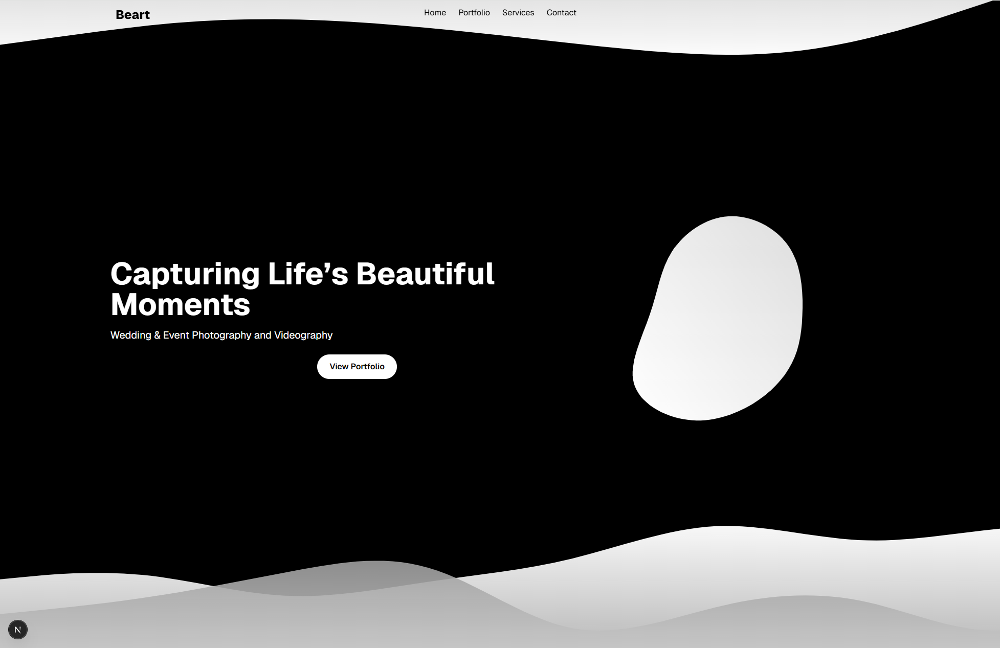
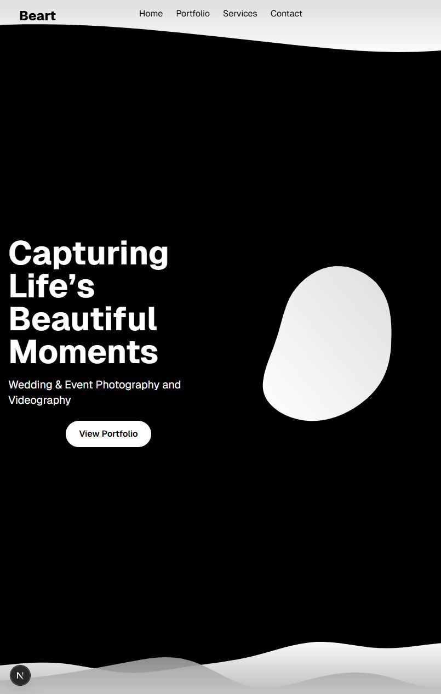
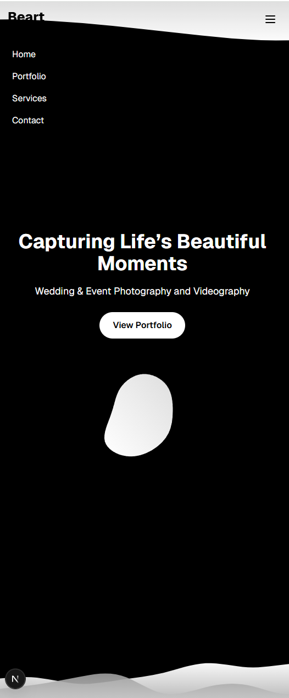

# 🎬 Beart

**Beart** is a simple React nextjs app for photographying blog/ecommerce business.


## 🛠️ Tech Stack

- React 
- Next JS
- TypeScript 
- CSS + Laravel


## 📦 Installation

1. Clone the repository:
   ```bash
   git clone https://github.com/baftjarjusufi/moviesreact.git
   cd moviesreact
2. Install dependencies:

     - npm install

4. Start the development server:

     - npm run dev 


## 📸 Screenshots  








